# Raif

[](https://badge.fury.io/rb/raif)
[](https://github.com/cultivate-labs/raif/actions/workflows/ci.yml)
[](https://opensource.org/licenses/MIT)
[](https://cultivatelabs.github.io/raif/)


Raif (Ruby AI Framework) is a Rails engine that helps you add AI-powered features to your Rails apps, such as [tasks](#tasks), [conversations](#conversations), and [agents](#agents).  It supports for multiple LLM providers including [OpenAI](#openai), [Anthropic Claude](#anthropic-claude), and [AWS Bedrock](#aws-bedrock).

Raif is built by [Cultivate Labs](https://www.cultivatelabs.com) and is used to power [ARC](https://www.arcanalysis.ai), an AI-powered research & analysis platform.

## Table of Contents
- [Setup](#setup)
  - [OpenAI](#openai)
  - [Anthropic Claude](#anthropic-claude)
  - [AWS Bedrock (Claude)](#aws-bedrock-claude)
- [Chatting with the LLM](#chatting-with-the-llm)
- [Key Raif Concepts](#key-raif-concepts)
  - [Tasks](#tasks)
  - [Conversations](#conversations)
    - [Conversation Types](#conversation-types)
  - [Agents](#agents)
  - [Model Tools](#model-tools)
- [Web Admin](#web-admin)
- [Customization](#customization)
  - [Controllers](#controllers)
  - [Models](#models)
  - [Views](#views)
  - [System Prompts](#system-prompts)
- [Testing](#testing)
- [Demo App](#demo-app)
- [License](#license)

# Setup

Add this line to your application's Gemfile:

```ruby
gem "raif"
```

And then execute:
```bash
bundle install
```

Run the install generator:
```bash
rails generate raif:install
```

This will:
- Create a configuration file at `config/initializers/raif.rb`
- Copy Raif's database migrations to your application
- Mount Raif's engine at `/raif` in your application's `config/routes.rb` file

Run the migrations. Raif is compatible with both PostgreSQL and MySQL databases.
```bash
rails db:migrate
```

If you plan to use the [conversations](#conversations) feature or Raif's [web admin](#web-admin), configure authentication and authorization for Raif's controllers in `config/initializers/raif.rb`:

```ruby
Raif.configure do |config|
  # Configure who can access non-admin controllers
  # For example, to allow all logged in users:
  config.authorize_controller_action = ->{ current_user.present? }

  # Configure who can access admin controllers
  # For example, to allow users with admin privileges:
  config.authorize_admin_controller_action = ->{ current_user&.admin? }
end
```

Configure your LLM providers. You'll need at least one of:

## OpenAI
```ruby
Raif.configure do |config|
  config.open_ai_models_enabled = true
  config.open_ai_api_key = ENV["OPENAI_API_KEY"]
  config.default_llm_model_key = "open_ai_gpt_4o"
end
```

Available OpenAI models:
- `open_ai_gpt_4o_mini`
- `open_ai_gpt_4o`
- `open_ai_gpt_3_5_turbo`

## Anthropic Claude
```ruby
Raif.configure do |config|
  config.anthropic_models_enabled = true
  config.anthropic_api_key = ENV["ANTHROPIC_API_KEY"]
  config.default_llm_model_key = "anthropic_claude_3_5_sonnet"
end
```

Available Anthropic models:
- `anthropic_claude_3_7_sonnet`
- `anthropic_claude_3_5_sonnet`
- `anthropic_claude_3_5_haiku`
- `anthropic_claude_3_opus`

## AWS Bedrock (Claude)
```ruby
Raif.configure do |config|
  config.anthropic_bedrock_models_enabled = true
  config.aws_bedrock_region = "us-east-1"
  config.default_llm_model_key = "bedrock_claude_3_5_sonnet"
end
```

Available Bedrock models:
- `bedrock_claude_3_5_sonnet`
- `bedrock_claude_3_7_sonnet`
- `bedrock_claude_3_5_haiku`
- `bedrock_claude_3_opus`

Note: Raif utilizes the [AWS Bedrock gem](https://docs.aws.amazon.com/sdk-for-ruby/v3/api/Aws/BedrockRuntime/Client.html) and AWS credentials should be configured via the AWS SDK (environment variables, IAM role, etc.)

# Chatting with the LLM

When using Raif, it's often useful to use one of the [higher level abstractions](#key-raif-concepts) in your application. But when needed, you can utilize `Raif::Llm` to chat with the model directly. All calls to the LLM will create and return a `Raif::ModelCompletion` record, providing you a log of all interactions with the LLM which can be viewed in the [web admin](#web-admin).

Call `Raif::Llm#chat` with either a `message` string or `messages` array.:
```ruby
llm = Raif.llm(:open_ai_gpt_4o) # will return a Raif::Llm instance
model_completion = llm.chat(message: "Hello")
puts model_completion.raw_response
# => "Hello! How can I assist you today?"
```

The `Raif::ModelCompletion` class will handle parsing the response for you, should you ask for a different response format (which can be one of `:html`, `:text`, or `:json`). You can also provide a `system_prompt` to the `chat` method:
```ruby
llm = Raif.llm(:open_ai_gpt_4o)
messages = [
  { role: "user", content: "Hello" },
  { role: "assistant", content: "Hello! How can I assist you today?" },
  { role: "user", content: "Can you you tell me a joke?" },
]

system_prompt = "You are a helpful assistant who specializes in telling jokes. Your response should be a properly formatted JSON object containing a single `joke` key. Do not include any other text in your response outside the JSON object."

model_completion = llm.chat(messages: messages, response_format: :json, system_prompt: system_prompt)
puts model_completion.raw_response
# => `​`​`json
# => {
# =>   "joke": "Why don't skeletons fight each other? They don't have the guts."
# => }
# => `​`​`

puts model_completion.parsed_response # will strip backticks, parse the JSON, and give you a Ruby hash
# => {"joke" => "Why don't skeletons fight each other? They don't have the guts."}
```

# Key Raif Concepts

## Tasks
If you have a single-shot task that you want an LLM to do in your application, you should create a `Raif::Task` subclass (see the end of this section for an example of using the task generator), where you'll define the prompt and response format for the task and call via `Raif::Task.run`. For example, say you have a `Document` model in your app and want to have a summarization task for the LLM:

```ruby
class Raif::Tasks::DocumentSummarization < Raif::ApplicationTask
  llm_response_format :html # options are :html, :text, :json
  
  # Any attr_accessor you define can be included as an argument when calling `run`. 
  # E.g. Raif::Tasks::DocumentSummarization.run(document: document, creator: user)
  attr_accessor :document
  
  def build_system_prompt
    sp = "You are an assistant with expertise in summarizing detailed articles into clear and concise language."
    sp += system_prompt_language_preference if requested_language_key.present?
    sp
  end

  def build_prompt
    <<~PROMPT
      Consider the following information:

      Title: #{document.title}
      Text:
      ```
      #{document.content}
      ```

      Your task is to read the provided article and associated information, and summarize the article concisely and clearly in approximately 1 paragraph. Your summary should include all of the key points, views, and arguments of the text, and should only include facts referenced in the text directly. Do not add any inferences, speculations, or analysis of your own, and do not exaggerate or overstate facts. If you quote directly from the article, include quotation marks.

      Format your response using basic HTML tags.

      If the text does not appear to represent the title, please return the text "#{summarization_failure_text}" and nothing else.
    PROMPT
  end

end
```

And then run the task (typically via a background job):
```
document = Document.first # assumes your app defines a Document model
user = User.first # assumes your app defines a User model
task = Raif::Tasks::DocumentSummarization.run(document: document, creator: user)
summary = task.parsed_response
```

You can also pass in a `requested_language_key` to the `run` method. When this is provided, Raif will add a line to the system prompt requesting that the LLM respond in the specified language:
```
task = Raif::Tasks::DocumentSummarization.run(document: document, creator: user, requested_language_key: "es")
```

Would produce a system prompt that looks like this:
```
You are an assistant with expertise in summarizing detailed articles into clear and concise language.
You're collaborating with teammate who speaks Spanish. Please respond in Spanish.
```

To generate a new task, you can use the generator:
```bash
rails generate raif:task DocumentSummarization --response-format html
```

## Conversations

Raif provides `Raif::Conversation` and `Raif::ConversationEntry` models that you can use to  provide an LLM-powered chat interface. It also provides controllers and views for the conversation interface.

This feature utilizes Turbo Streams, Stimulus controllers, and ActiveJob, so your application must have those set up first. 

To use it in your application, first set up the css and javascript in your application. In the `<head>` section of your layout file:
```erb
<%= stylesheet_link_tag "raif" %>
```

In an app using import maps, add the following to your `application.js` file:
```js
import "raif"
```

In a controller serving the conversation view:
```ruby
class ExampleConversationController < ApplicationController
  def show
    @conversation = Raif::Conversation.where(creator: current_user).order(created_at: :desc).first

    if @conversation.nil?
      @conversation = Raif::Conversation.new(creator: current_user)
      @conversation.save!
    end
  end
end
```

And then in the view where you'd like to display the conversation interface:
```erb
<%= raif_conversation(@conversation) %>
```

If your app already includes Bootstrap styles, this will render a conversation interface that looks something like:

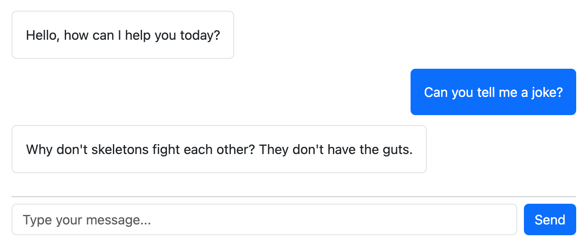

If your app does not include Bootstrap, you can [override the views](#views) to update styles.

### Conversation Types

If your application has a specific type of conversation that you use frequently, you can create a custom conversation type by running the generator. For example, say you are implementing a customer support chatbot in your application and want to have a custom conversation type for doing this with the LLM:
```bash
rails generate raif:conversation CustomerSupport
```

This will create a new conversation type in `app/models/raif/conversations/customer_support.rb`.

You can then customize the system prompt, initial message, and available [model tools](#model-tools) for that conversation type:

```ruby
class Raif::Conversations::CustomerSupport < Raif::Conversation
  before_create -> { 
    self.available_model_tools = [
      "Raif::ModelTools::SearchKnowledgeBase",
      "Raif::ModelTools::FileSupportTicket" 
    ]
  }

  def system_prompt_intro
    <<~PROMPT
      You are a helpful assistant who specializes in customer support. You're working with a customer who is experiencing an issue with your product.
    PROMPT
  end

  def initial_chat_message
    I18n.t("#{self.class.name.underscore.gsub("/", ".")}.initial_chat_message")
  end
end
```


## Agents

Raif also provides `Raif::Agents::ReActAgent`, which implements a ReAct-style agent loop using [tool calls](#model-tools):

```ruby
# Create a new agent
agent = Raif::Agents::ReActAgent.new(
  task: "Research the history of the Eiffel Tower",
  available_model_tools: [Raif::ModelTools::WikipediaSearch, Raif::ModelTools::FetchUrl],
  creator: current_user
)

# Run the agent and get the final answer
final_answer = agent.run!

# Or run the agent and monitor its progress
agent.run! do |conversation_history_entry|
  Turbo::StreamsChannel.broadcast_append_to(
    :my_agent_channel,
    target: "agent-progress",
    partial: "my_partial_displaying_agent_progress",
    locals: { agent: agent, conversation_history_entry: conversation_history_entry }
  )
end
```

On each step of the agent loop, an entry will be added to the `Raif::Agent#conversation_history` and, if you pass a block to the `run!` method, the block will be called with the `conversation_history_entry` as an argument. You can use this to monitor and display the agent's progress in real-time.

The conversation_history_entry will be a hash with "role" and "content" keys:
```ruby
{
  "role" => "assistant",
  "content" => "a message here"
}
```

### Creating Custom Agents

You can create custom agents using the generator:
```bash
rails generate raif:agent WikipediaResearchAgent
```

This will create a new agent in `app/models/raif/agents/wikipedia_research_agent.rb`:

```ruby
module Raif
  module Agents
    class WikipediaResearchAgent < Raif::Agent
      # If you want to always include a certain set of model tools with this agent type,
      # uncomment this callback to populate the available_model_tools attribute with your desired model tools.
      # before_create -> {
      #   self.available_model_tools ||= [
      #     Raif::ModelTools::WikipediaSearchTool,
      #     Raif::ModelTools::FetchUrlTool
      #   ]
      # }

      # Enter your agent's system prompt here. Alternatively, you can change your agent's superclass
      # to an existing agent types (like Raif::Agents::ReActAgent) to utilize an existing system prompt.
      def build_system_prompt
        # TODO: Implement your system prompt here
      end

      # Each iteration of the agent loop will generate a new Raif::ModelCompletion record and
      # then call this method with it as an argument.
      def process_iteration_model_completion(model_completion)
        # TODO: Implement your iteration processing here
      end
    end
  end
end

```

## Model Tools

Raif provides a `Raif::ModelTool` base class that you can use to create custom tools for your agents and conversations. [`Raif::ModelTools::WikipediaSearch`](https://github.com/CultivateLabs/raif/blob/main/app/models/raif/model_tools/wikipedia_search.rb) and [`Raif::ModelTools::FetchUrl`](https://github.com/CultivateLabs/raif/blob/main/app/models/raif/model_tools/fetch_url.rb) tools are included as examples.

You can create your own model tools to provide to the LLM using the generator:
```bash
rails generate raif:model_tool GoogleSearch
```

This will create a new model tool in `app/models/raif/model_tools/google_search.rb`:

```ruby
class Raif::ModelTools::GoogleSearch < Raif::ModelTool
  # For example tool implementations, see: 
  # Wikipedia Search Tool: https://github.com/CultivateLabs/raif/blob/main/app/models/raif/model_tools/wikipedia_search_tool.rb
  # Fetch URL Tool: https://github.com/CultivateLabs/raif/blob/main/app/models/raif/model_tools/fetch_url_tool.rb

  # An example of how the LLM should invoke your tool. This should return a hash with name and arguments keys.
  # `to_json` will be called on it and provided to the LLM as an example of how to invoke your tool.
  def self.example_model_invocation
    {
      "name": tool_name,
      "arguments": { "query": "example query here" }
    }
  end

  # Define your tool's argument schema here. It should be a valid JSON schema.
  # When the model invokes your tool, the arguments it provides will be validated
  # against this schema using JSON::Validator from the json-schema gem.
  def self.tool_arguments_schema
    # For example:
    # {
    #   type: "object",
    #   additionalProperties: false,
    #   required: ["query"],
    #   properties: {
    #     query: {
    #       type: "string",
    #       description: "The query to search for"
    #     }
    #   }
    # }
    # Would expect the model to invoke your tool with an arguments JSON object like:
    # { "query" : "some query here" }
  end

  def self.tool_description
    "Description of your tool that will be provided to the LLM so it knows when to invoke it"
  end

  # When your tool is invoked by the LLM in a Raif::Agent loop, 
  # the results of the tool invocation are provided back to the LLM as an observation.
  # This method should return whatever you want provided to the LLM.
  # For example, if you were implementing a GoogleSearch tool, this might return a JSON
  # object containing search results for the query.
  def self.observation_for_invocation(tool_invocation)
    return "No results found" unless tool_invocation.result.present?

    JSON.pretty_generate(tool_invocation.result)
  end

  # When the LLM invokes your tool, this method will be called with a `Raif::ModelToolInvocation` record as an argument.
  # It should handle the actual execution of the tool. 
  # For example, if you are implementing a GoogleSearch tool, this method should run the actual search
  # and store the results in the tool_invocation's result JSON column.
  def self.process_invocation(tool_invocation)
    # Extract arguments from tool_invocation.tool_arguments
    # query = tool_invocation.tool_arguments["query"]
    #
    # Process the invocation and perform the desired action
    # ...
    #
    # Store the results in the tool_invocation
    # tool_invocation.update!(
    #   result: {
    #     # Your result data structure
    #   }
    # )
    #
    # Return the result
    # tool_invocation.result
  end

end
```

# Web Admin

Raif includes a web admin interface for viewing all interactions with the LLM. Assuming you have the engine mounted at `/raif`, you can access the admin interface at `/raif/admin`.

The admin interface contains sections for:
- Model Completions
- Tasks
- Conversations
- Agents
- Model Tool Invocations


### Model Completions
  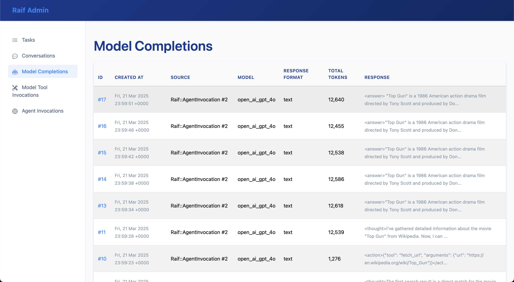
  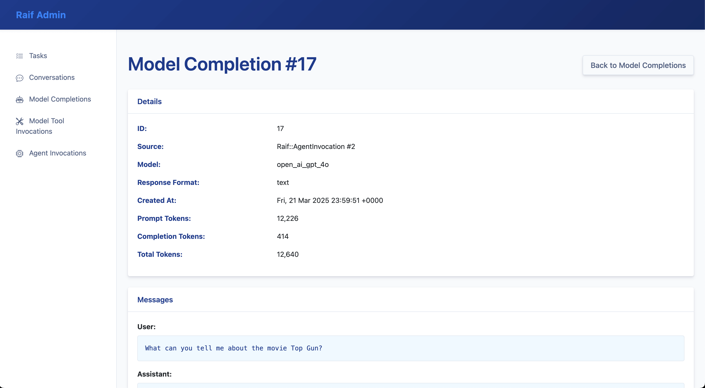

### Tasks
  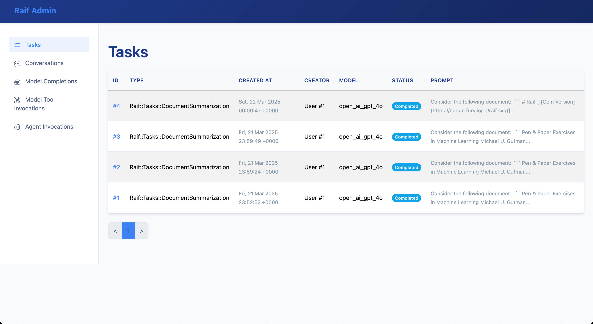

### Conversations
  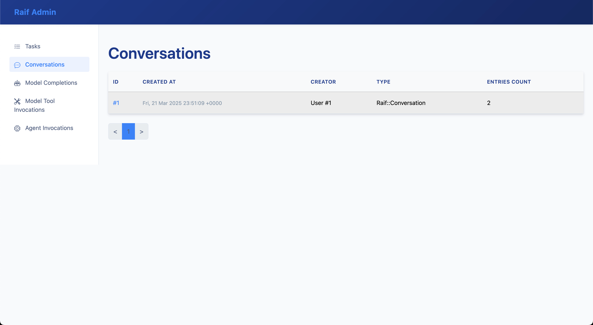
  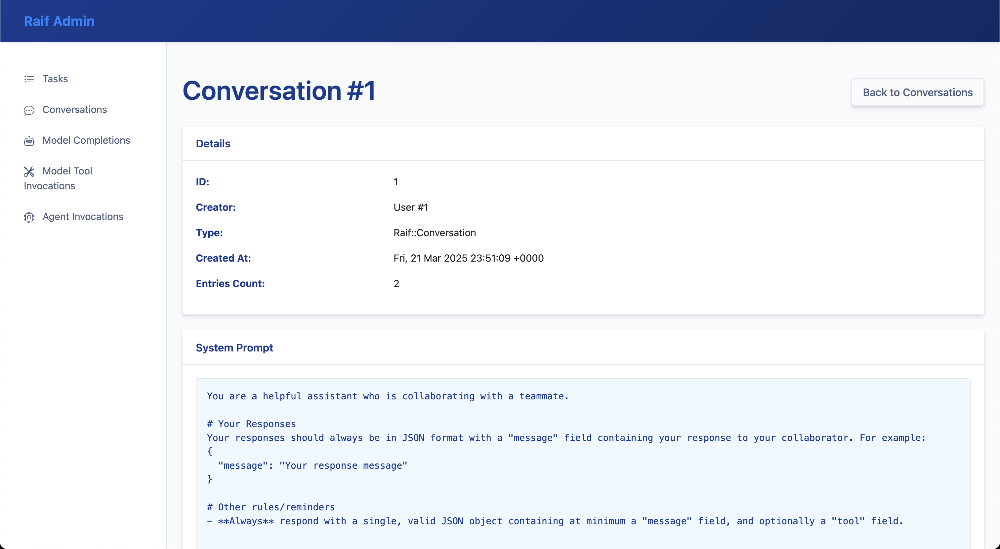

### Agents
  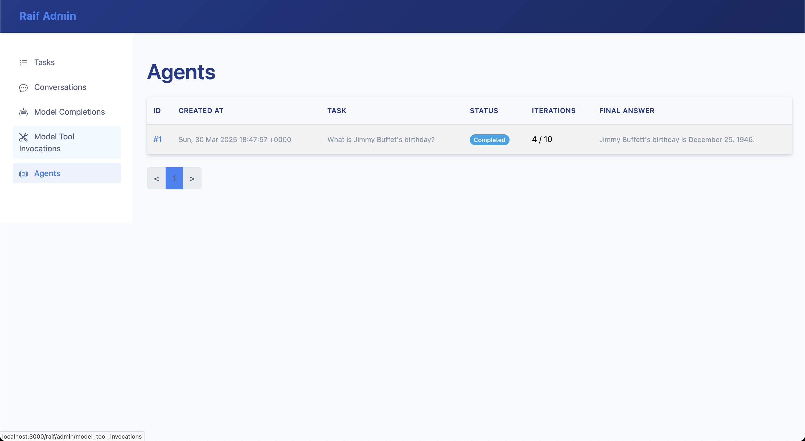
  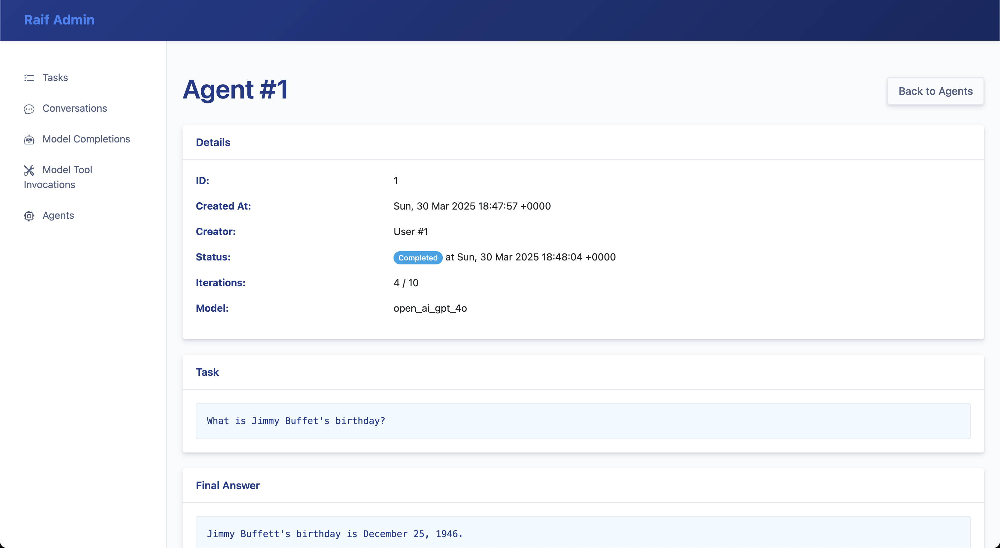

### Model Tool Invocations
  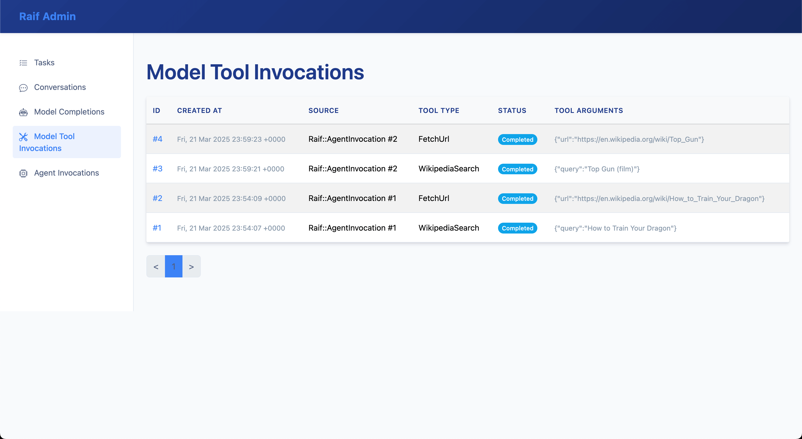
  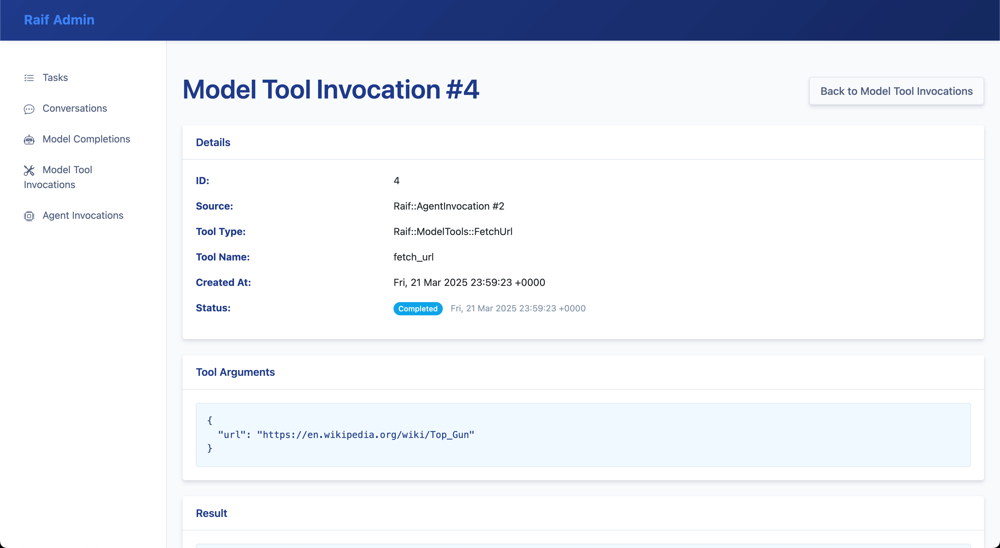

# Customization

## Controllers

You can override Raif's controllers by creating your own that inherit from Raif's base controllers:

```ruby
class ConversationsController < Raif::ConversationsController
  # Your customizations here
end

class ConversationEntriesController < Raif::ConversationEntriesController
  # Your customizations here
end
```

Then update the configuration:
```ruby
Raif.configure do |config|
  config.conversations_controller = "ConversationsController"
  config.conversation_entries_controller = "ConversationEntriesController"
end
```

## Models

By default, Raif models inherit from `ApplicationRecord`. You can change this:

```ruby
Raif.configure do |config|
  config.model_superclass = "CustomRecord"
end
```

## Views

You can customize Raif's views by copying them to your application and modifying them. To copy the conversation-related views, run:

```bash
rails generate raif:views
```

This will copy all conversation and conversation entry views to your application in:
- `app/views/raif/conversations/`
- `app/views/raif/conversation_entries/`

These views will automatically override Raif's default views. You can customize them to match your application's look and feel while maintaining the same functionality.

## System Prompts

If you don't want to override the system prompt entirely in your task/conversation/agent subclasses, you can customize the intro portion of the system prompts for conversations and tasks:

```ruby
Raif.configure do |config|
  config.conversation_system_prompt_intro = "You are a helpful assistant who specializes in customer support."
  config.task_system_prompt_intro = "You are a helpful assistant who specializes in data analysis."
end
```

# Testing

Raif includes RSpec helpers and FactoryBot factories to help with testing in your application.

To use the helpers, add the following to your `rails_helper.rb`:

```ruby
require "raif/rspec"

RSpec.configure do |config|
  config.include Raif::RspecHelpers
end
```

You can then use the helpers to stub LLM calls:

```ruby
it "stubs a document summarization task" do
  # the messages argument is the array of messages sent to the LLM. It will look something like:
  # [{"role" => "user", "content" => "The prompt from the Raif::Tasks::DocumentSummarization task" }]
  stub_raif_task(Raif::Tasks::DocumentSummarization) do |messages|
    "Stub out the response from the LLM"
  end

  user = FactoryBot.create(:user) # assumes you have a User model & factory
  document = FactoryBot.create(:document) # assumes you have a Document model & factory
  task = Raif::Tasks::DocumentSummarization.run(document: document, creator: user)

  expect(task.raw_response).to eq("Stub out the response from the LLM")
end

it "stubs a conversation" do
  user = FactoryBot.create(:user) # assumes you have a User model & factory
  conversation = FactoryBot.create(:raif_test_conversation, creator: user)
  conversation_entry = FactoryBot.create(:raif_conversation_entry, raif_conversation: conversation, creator: user)

  stub_raif_conversation(conversation) do |messages|
    "Hello"
  end

  conversation_entry.process_entry!
  expect(conversation_entry.reload).to be_completed
  expect(conversation_entry.model_response_message).to eq("Hello")
end

it "stubs an agent" do
  i = 0
  stub_raif_agent(agent) do |_messages|
    i += 1
    if i == 1
      "<thought>I need to search.</thought>\n<action>{\"tool\": \"wikipedia_search\", \"arguments\": {\"query\": \"capital of France\"}}</action>"
    else
      "<thought>Now I know.</thought>\n<answer>Paris</answer>"
    end
  end
end
```

Raif also provides FactoryBot factories for its models. You can use them to create Raif models for testing. If you're using `factory_bot_rails`, they will be added automatically to `config.factory_bot.definition_file_paths`. The available factories can be found [here](https://github.com/CultivateLabs/raif/tree/main/spec/factories/shared).

# Demo App

Raif includes a [demo app](https://github.com/CultivateLabs/raif_demo) that you can use to see the engine in action. Assuming you have Ruby 3.4.2 and Postgres installed, you can run the demo app with:

```bash
git clone git@github.com:CultivateLabs/raif_demo.git
cd raif_demo
bundle install
bin/rails db:create db:prepare
OPENAI_API_KEY=your-openai-api-key-here bin/rails s
```

You can then access the app at [http://localhost:3000](http://localhost:3000).

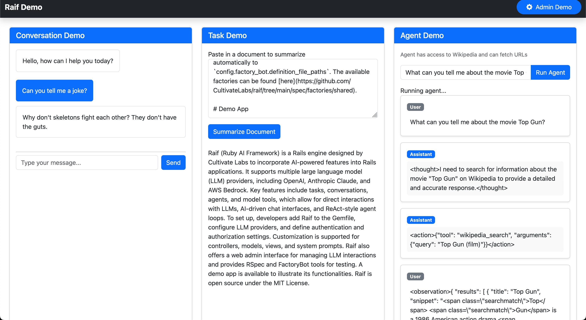

# License

The gem is available as open source under the terms of the MIT License.
